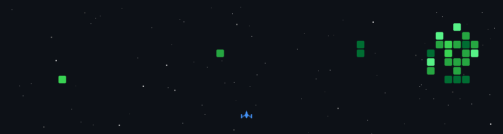

  

  

### Programming Languages

### Frameworks

### Frontend Technologies

### Backend Technologies

### Databases

### DevOps Tools

### Cloud Services

### Operating Systems

json
[
  {
    "name": "Ride-Sharing Platform",
    "stack": ["Python", "Backend", "Mobile"],
    "goal": "Rider-defined pricing ecosystem"
  },
  {
    "name": "Flood Prediction AI",
    "stack": ["Python", "UGNF", "Neural Networks"],
    "goal": "Predict flood risks using ML"
  },
  {
    "name": "Aadhaar CRUD Manager",
    "stack": ["Java", "JPA", "MySQL"],
    "goal": "Secure identity record management"
  }
]

## 📊 LeetCode Stats

  

> Every commit is a signal. Every project is a system. Every system tells a story.

  
  

<!-- GAME ANIMATION SECTION -->
<!-- 

  

 -->
<!-- 

  

 -->
